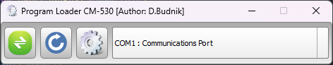
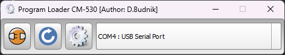
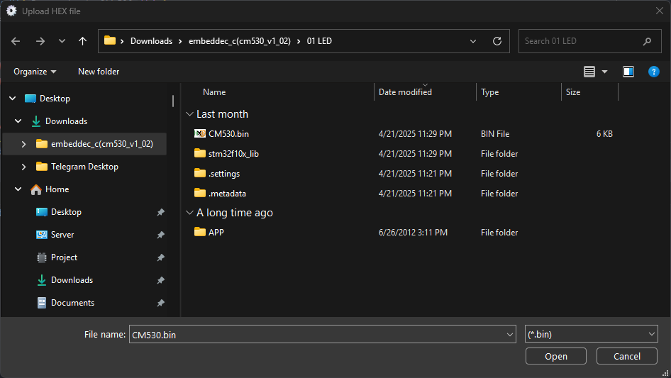
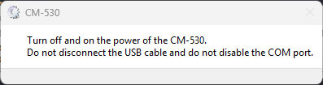
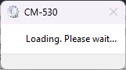
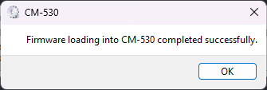

# **Program Loader CM-530** – программное обеспечение для загрузки прошивки в микроконтроллер CM-530.  

**Program Loader CM-530** — это кроссплатформенное приложение для загрузки прошивки в микроконтроллер **CM-530** через последовательный порт. Утилита предоставляет простой и интуитивно понятный интерфейс, обеспечивая стабильную и безопасную передачу бинарного файла в устройство.

---

## 🔧 Краткий алгоритм действий

1. Запустите программу, подключите CM-530 по USB, выберите нужный COM порт и подключитесь.
2. После подключения кнопка изменит внешний вид и можно будет нажать на кнопку прошивки (с изображением шестерёнки). 
3. Откроется диалоговое окно, в нём выберите файл прошивки в формате `.bin`.
4. После вылезет сообщение о том, что необходимо выключить и включить питание CM-530, при этом USB провод и COM порт должны быть подключены.
5. Начнётся загрузка прошивки сразу после переключения питания. Обычно занимает 2-3 секунды.
6. После загрузки прошивки появится диалоговое окно о завершении процедуры.

---

## 🔧 Возможности

- Определение доступных COM-портов
- Подключение к устройству CM-530
- Загрузка прошивки в формате `.bin`
- Подсказки пользователю во время процесса прошивки
- Отображение статуса и сообщений о ходе выполнения
- Блокировка действий во избежание ошибок во время записи

---

## 📸 Интерфейс программы

### 1. Главное окно
После запуска отображается главное окно программы с выпадающим списком COM-портов и кнопкой подключения:



---

### 2. Подключение к устройству
При успешном подключении к выбранному порту, кнопка меняет внешний вид, и становится активной кнопка загрузки прошивки (изображение с шестерёнкой):



---

### 3. Выбор файла прошивки
Открывается диалог выбора файла. Необходимо выбрать `.bin` файл прошивки:



---

### 4. Инструкция пользователю
После выбора файла появляется окно с инструкцией:
> **Turn off and on the power of the CM-530.**  
> **Do not disconnect the USB cable and do not disable the COM port.**

> **Выключите и включите питание CM-530.**
> **Не отсоединяйте USB-кабель и не отключайте COM-порт.**



---

### 5. Загрузка прошивки
После перезагрузки устройства начинается процесс загрузки:
> **Loading. Please wait...**

> **Загрузка. Пожалуйста, подождите...**



---

### 6. Завершение
После завершения загрузки появится уведомление об успешной записи прошивки:
> **Firmware loading into CM-530 completed successfully.**

> **Загрузка прошивки в CM-530 успешно завершена.**
> 


---

## 📝 Требования

- Операционная система: Windows (под Linux и macOS нужно внести корректировки в коде)
- Qt 5.15 или новее
- Наличие драйвера CH340G 
- Подключённый по USB микроконтроллер **CM-530**
- **CMake** ≥ 3.31
- **Компилятор**, поддерживающий C++17 (MSVC, GCC, Clang)

---

## 🛠️ Сборка из исходников

```bash
git clone https://github.com/your-repo/program-loader-cm530.git
cd Program_Loader_CM-530
mkdir build && cd build
cmake .. -DCMAKE_BUILD_TYPE=Release
cmake --build . --config Release
